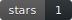
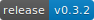
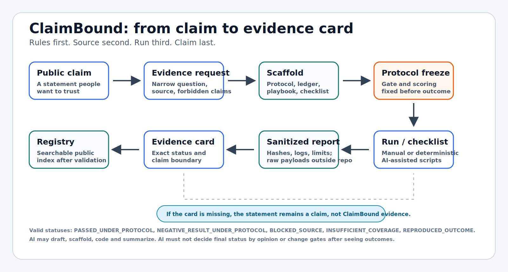
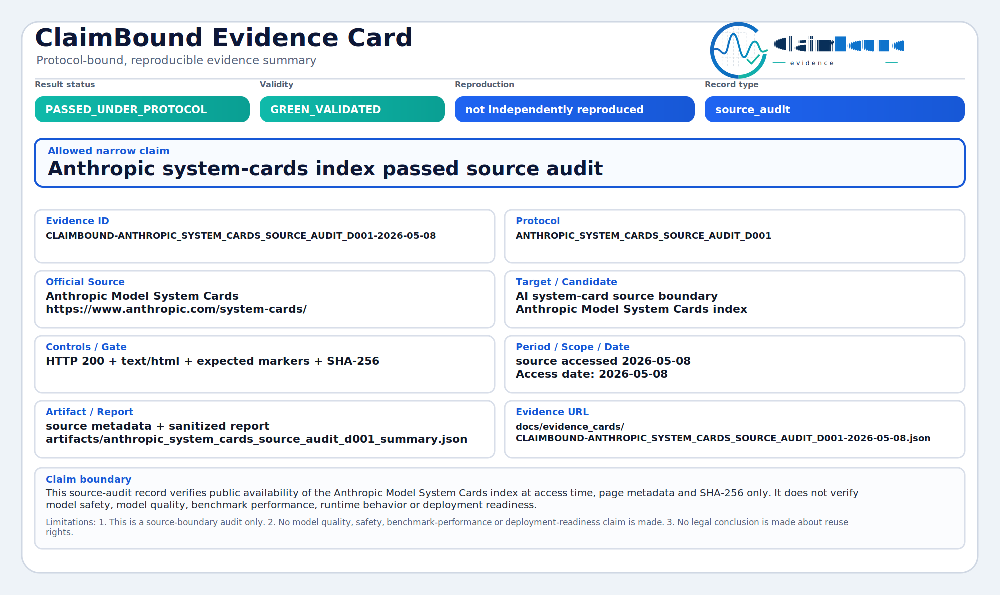
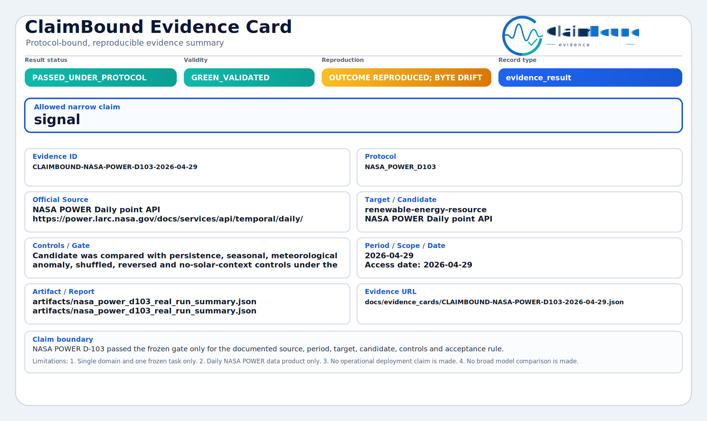
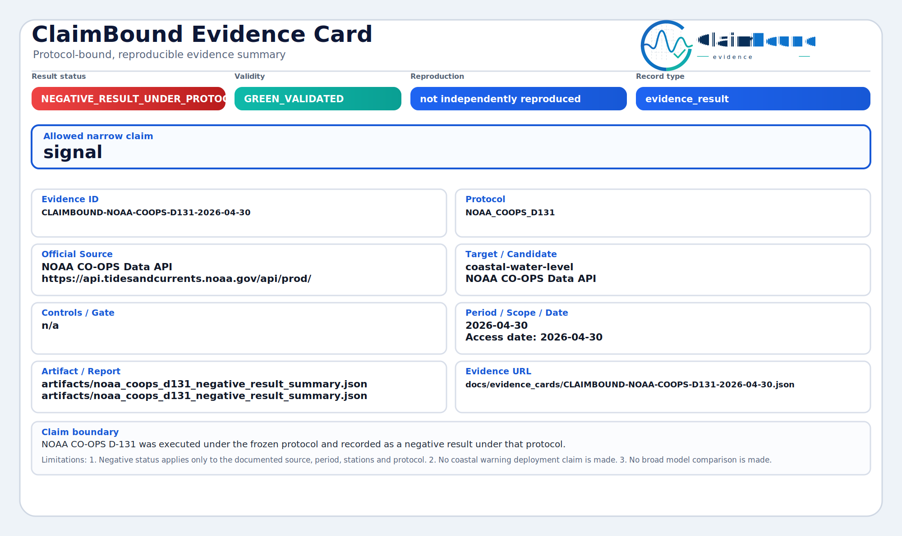

# ClaimBound Evidence

[](https://github.com/ClaimBound/claimbound-evidence/stargazers)
[](https://github.com/ClaimBound/claimbound-evidence/blob/main/LICENSE)
[](https://github.com/ClaimBound/claimbound-evidence/blob/main/pyproject.toml)
[](https://github.com/ClaimBound/claimbound-evidence/actions/workflows/tests.yml)
[](https://github.com/ClaimBound/claimbound-evidence/releases/tag/v0.3.0)

<p align="center">
  
</p>

ClaimBound turns a narrow public AI, ML, data or software-development claim into
a small evidence card: a checkable record with the protocol, source boundary,
hashes, exact result status, claim boundary and reproduction level.

It is not a model leaderboard, production forecasting service or certification
authority. It is an open-source toolkit for asking one plain question:

```text
Where is the evidence?
```

If there is no evidence card, the statement is still only a claim.

<h2 id="claimbound-in-30-seconds">ClaimBound In 30 Seconds</h2>

ClaimBound turns a public statement like "we checked this", "this source
exists", "this benchmark reproduced", "this model is better" or "this risky
change passed" into a small evidence card: what exactly was checked, under
which frozen protocol, against which source, with which status, hashes,
limitations and reproduction level.

Its main job is anti-overclaiming. Green means one narrow claim passed under the
stated protocol, not "trust everything". Negative, blocked, insufficient and
drift results are first-class evidence too, because they stop weak or incomplete
claims from being silently upgraded into stronger ones.

Open the standalone document:
[docs/CLAIMBOUND_IN_30_SECONDS.md](docs/CLAIMBOUND_IN_30_SECONDS.md).



## For Reviewers And External Operators

Start here if you are reviewing the project, trying it from outside the
maintainer's machine, or checking what the open-source foreground is meant to
deliver:

- [Reviewer summary](docs/NLNET_REVIEWER_SUMMARY.md) gives the problem,
  strongest cards, European/public-interest dimension and funding-sized
  deliverables in one page.
- [Public funding roadmap 2026](docs/FUNDING_ROADMAP_2026.md) maps the current
  9-month open-source work package to concrete software, workflow and
  documentation outputs.
- [External operator starter pack](docs/EXTERNAL_OPERATOR_STARTER_PACK.md)
  explains how to read cards, request a card, rerun an existing card, report
  source drift or ask a boundary question.

## What A Card Shows

An evidence card keeps the useful claim small enough to inspect:

| Card field | Plain meaning |
| --- | --- |
| Claim | The exact public statement being checked. |
| Source | The public source or source documentation used for the check. |
| Protocol | The rules fixed before the result was accepted. |
| Status | Passed, negative, blocked, insufficient or reproduced. |
| Boundary | What the card proves and what it must not be used to claim. |
| Reproduction | Whether another run reproduced the outcome, and with what limits. |

Raw payloads, prompt text, transcripts and restricted source files stay outside
the public repository unless redistribution is clearly allowed. The public
record stores hashes, summaries and links so a local operator or organization
can keep private evidence reproducible without publishing sensitive material.

## Choosing Protocol V2 And V3

The evidence card is the result. Protocol v2 and v3 are optional guardrails
around the result, not stronger evidence by themselves.

| Need | Use | Read next |
| --- | --- | --- |
| Publish one completed narrow result. | Evidence card JSON/SVG and sanitized report. | [Evidence card protocol](docs/EVIDENCE_CARD.md) |
| Keep related R&D fair across diagnostics, proof tracks, stop rules and closure. | Protocol v2 family/frontier ledgers. | [R&D family protocol v2](docs/R_AND_D_FAMILY_PROTOCOL.md) |
| Give public readers a compact map of iron claims, flow claims, tombstones and blocked branches. | Protocol v3 tree overlay. | [Protocol v3 tree overlay](docs/PROTOCOL_V3_TREE_OVERLAY.md) |
| Decide which stack an audience should use. | Smallest honest stack: card only, card + v2, or card + v2 + v3. | [Protocol use by layer and audience](docs/PROTOCOL_USE_BY_LAYER_AND_AUDIENCE.md) |

Practical rule: use the smallest layer stack that prevents overclaiming. Do not
add v2 or v3 to make a weak result look stronger.

## Example: AI System-Card Claim

Public claim:

```text
Anthropic publishes a public system-card index for its AI models.
```

ClaimBound narrows it:

```text
Can the official Anthropic system-card page be source-audited by URL, access
date, content type, expected markers and SHA-256 without making any model
safety, model quality or runtime-behavior claim?
```

Current card status:

```text
PASSED_UNDER_PROTOCOL / GREEN_VALIDATED
```

What this proves: the public source boundary passed the documented source-audit
gate at access time.

What it does not prove: that Claude or any Anthropic runtime is safer, better,
unchanged, deployment-ready or benchmark-superior.

[Read the JSON](docs/evidence_cards/CLAIMBOUND-ANTHROPIC_SYSTEM_CARDS_SOURCE_AUDIT_D001-2026-05-08.json)
or open the
[visual SVG card](docs/evidence_cards/CLAIMBOUND-ANTHROPIC_SYSTEM_CARDS_SOURCE_AUDIT_D001-2026-05-08.svg).

## Example Cards

These are deliberately different outcomes: green means a narrow claim passed,
yellow means reproduction is useful but limited, amber means the source boundary
blocked a fair result, and red means the protocol ran but the claim did not
pass.

<p>
  
  
  
</p>

| Example | Status | What the card proves | Links |
| --- | --- | --- | --- |
| Anthropic system-card source audit | `PASSED_UNDER_PROTOCOL` | The official system-card index passed a narrow public-document source audit. | [JSON](docs/evidence_cards/CLAIMBOUND-ANTHROPIC_SYSTEM_CARDS_SOURCE_AUDIT_D001-2026-05-08.json) / [SVG](docs/evidence_cards/CLAIMBOUND-ANTHROPIC_SYSTEM_CARDS_SOURCE_AUDIT_D001-2026-05-08.svg) |
| Funding-fit self-check | `PASSED_UNDER_PROTOCOL` | Public ClaimBound materials mapped to selected public-interest open-source funding eligibility categories without claiming approval, endorsement or award likelihood. | [JSON](docs/evidence_cards/CLAIMBOUND-FUNDING_FIT_D001-2026-06-04.json) / [SVG](docs/evidence_cards/CLAIMBOUND-FUNDING_FIT_D001-2026-06-04.svg) |
| EEA AQ manual track | `BLOCKED_SOURCE` | The larger PM10 manual track could not fairly run from an incomplete public URL manifest. | [JSON](docs/evidence_cards/CLAIMBOUND-EEA-AQ-D001-MANUAL-2026-05-11.json) / [SVG](docs/evidence_cards/CLAIMBOUND-EEA-AQ-D001-MANUAL-2026-05-11.svg) |
| NASA POWER D-103 | `PASSED_UNDER_PROTOCOL` with `REPRODUCED_OUTCOME_WITH_SOURCE_BYTE_DRIFT` | The frozen gate-level outcome reproduced, but fresh source bytes differed. | [JSON](docs/evidence_cards/CLAIMBOUND-NASA-POWER-D103-2026-04-29.json) / [SVG](docs/evidence_cards/CLAIMBOUND-NASA-POWER-D103-2026-04-29.svg) |
| NOAA CO-OPS D-131 | `NEGATIVE_RESULT_UNDER_PROTOCOL` | The official-source run completed and honestly did not pass the frozen gate. | [JSON](docs/evidence_cards/CLAIMBOUND-NOAA-COOPS-D131-2026-04-30.json) / [SVG](docs/evidence_cards/CLAIMBOUND-NOAA-COOPS-D131-2026-04-30.svg) |

## Twelve Public Use Categories

The public examples are easier to understand by audience. Every row below says
who the evidence discipline helps, what kind of claim it checks, what has been
proven so far, and what to do next.

| Audience / category | Typical task | Current examples | What we proved | Status and next step |
| --- | --- | --- | --- | --- |
| Public AI transparency readers | Check whether AI vendors publish inspectable public documentation. | Anthropic system cards, OpenAI GPT-5 system-card PDF, Google DeepMind model cards, xAI Grok prompts. | Official public pages or repositories were reachable and hashed under a source-audit boundary. | Green source-audit cards exist. Next: independent reruns and narrower runtime-equivalence requests where sources allow it. |
| AI and LLM evaluation teams | Check whether a benchmark or model claim has model ID, prompt set, scoring rule and transcript hashes. | `MODEL_EVAL_D001`. | The current source did not provide enough material for a fair public evidence result. | `BLOCKED_SOURCE`. Next: provide frozen prompts, model/API metadata, transcript hashes and scoring code. |
| AI risk, security and automation-control teams | Turn broad AI-control rules into bounded claims for agent tool use, prompt-injection checks, security-sensitive code, robotics scenarios, vehicle-software release gates or incident evidence. | [AI risk control with ClaimBound](docs/AI_RISK_CONTROL_WITH_CLAIMBOUND.md), protocol v2/v3 planning layers. | Guidance exists for using ClaimBound as an evidence-bound control layer without claiming certification, hacker-proofing, physical runtime control or complete risk removal. | Next: publish a completed narrow card for one AI-agent, security-scan, robotics-scenario or release-gate claim. |
| Software developers and maintainers | Add a reviewable evidence trail for risky, public, regression-sensitive or AI-assisted software changes. | [Software development workflow](docs/SOFTWARE_DEVELOPMENT_WORKFLOW.md), protocol v2/v3 planning layers. | ClaimBound can document fixed commands, fixtures, sanitized logs, hashes and limitation boundaries without replacing tests, CI or code review. | Guidance exists. Next: publish a completed narrow software evidence card for one build, API, parity or regression claim. |
| Companies with AI products | Turn a product claim into a customer-readable evidence card. | `AI_PRODUCT_CLAIM_D001`. | The public product announcement was not enough to support an empirical pass/fail claim. | `BLOCKED_SOURCE`. Next: publish exact claim, model/source docs, prompt or transcript manifest and limitations. |
| Independent verifiers and public buyers | Decide what is independently checkable before adopting an AI system. | `PROCUREMENT_AI_D001`. | Procurement evidence needs source, scoring and model metadata before it can become decision support. | `BLOCKED_SOURCE`. Next: run a vendor-claim protocol with frozen sources and stop rules. |
| Data stewards and public-data teams | Verify official source pages, rights notes and raw-payload policy before analysis. | EEA Air Quality source audit, EEA AQ manual track. | EEA passed a narrow download-page source audit, but the larger PM10 manual track blocked because the API URL-list manifest was incomplete for BE/NL. | EEA source audit is green; EEA manual track is a blocked-source card. Next: complete raw-payload reruns only with a full external manifest. |
| Civic tech, journalism and watchdogs | Check claims about mobility, infrastructure, climate or public services against official data. | NYC TLC Phase 4 artifact, `CIVIC_CLAIM_D001`. | Current civic examples show why official source access and frozen gates matter before public claims. | Blocked or artifact-only. Next: add a full evidence card or keep the artifact clearly marked as non-card evidence. |
| Open science and reproducibility teams | Reproduce a published result and keep negative or drift outcomes citable. | NASA POWER D-103, `REPRO_APPENDIX_D001`. | NASA reproduced the gate-level outcome with source-byte drift; the reproduction appendix scaffold still needs stronger source linkage. | NASA is yellow-limited reproduction. Next: add independent rerun records. |
| ML researchers | Separate a narrow method result from broad model-superiority language. | `ML_APPENDIX_D001`. | The current appendix scaffold shows required controls, baselines and claim boundary, but no completed empirical result. | `BLOCKED_SOURCE`. Next: run with frozen controls and publish exact pass/negative/blocked status. |
| Educators | Teach reproducible ML discipline with small public examples. | `EDU_REPRO_D001`. | The classroom track is ready as a scaffold, not as a completed evidence claim. | `BLOCKED_SOURCE`. Next: complete a student-friendly run and publish limitations. |
| Funding reviewers and program evaluators | Read what was promised, which source was used, what happened and what cannot be claimed. | `FUNDING_REVIEW_D001`, `FUNDING_FIT_D001`. | A funding appendix needs protocol, source, status and limitations instead of a narrative success claim. The completed self-check maps public project materials to selected public-interest eligibility categories without claiming approval or award likelihood. | Review appendix: `BLOCKED_SOURCE`. Self-check: `PASSED_UNDER_PROTOCOL`, single-operator only. Next: attach validated cards to reports or proposals without exposing private application material. |

For the full card list, see
[docs/evidence_cards/README.md](docs/evidence_cards/README.md). The registry
index is [docs/registry/evidence_index.json](docs/registry/evidence_index.json).

For a simple funding-review self-check runbook, see
[Funding eligibility self-check](docs/examples/FUNDING_ELIGIBILITY_SELF_CHECK.md).
For the completed non-branded example, see
[FUNDING_FIT_D001](docs/evidence_cards/CLAIMBOUND-FUNDING_FIT_D001-2026-06-04.json).

Start with [ClaimBound in 30 seconds](docs/CLAIMBOUND_IN_30_SECONDS.md), then
read [ClaimBound in 5 minutes](docs/CLAIMBOUND_IN_5_MINUTES.md) for the
plain-language version.

## Install

```bash
uv sync --extra dev
uv run --extra dev python -m pytest -n auto
```

## Quick Start

Create a draft scaffold:

```bash
uv run claimbound new
```

Create the same scaffold non-interactively:

```bash
uv run claimbound new \
  --source-url "https://example.org/source-docs" \
  --protocol-id "EXAMPLE_D001" \
  --domain "public-data" \
  --track-type "source_audit" \
  --execution-mode "MANUAL_NO_AI" \
  --out "docs/manual_audit/EXAMPLE_D001"
```

Run local demo helpers:

```bash
uv run claimbound demo eea-source-audit
uv run claimbound demo grok-source-audit
uv run claimbound validate-all
```

`validate-all` checks committed evidence cards, the registry and any optional
`docs/track_families/*_FAMILY_LEDGER.json`, `docs/track_families/*_FRONTIER.json`
or `docs/track_families/*_TREE.json` files. Historical cards created before the
R&D family protocol do not need retroactive ledgers.

Prepare a local-only run root:

```bash
uv run claimbound run-root \
  --protocol-id EXAMPLE_D001 \
  --source-url https://example.org/source \
  --operator your-name-or-handle
```

`claimbound new` creates a request, protocol draft, playbook, checklist,
operator declaration, draft card, R&D family ledger and source-probe summary.
It is not evidence. Evidence begins only after an operator freezes the
protocol, runs the check, publishes a sanitized report, validates the card and
updates the registry.

## Next Steps: Simple To Technical

| Step | Document | Why read it |
| --- | --- | --- |
| 1 | [ClaimBound in 30 seconds](docs/CLAIMBOUND_IN_30_SECONDS.md) | The one-screen explanation. |
| 2 | [ClaimBound in 5 minutes](docs/CLAIMBOUND_IN_5_MINUTES.md) | The shortest plain-language walkthrough. |
| 3 | [Evidence card examples](docs/evidence_cards/README.md) | Green, yellow, red and blocked examples in one place. |
| 4 | [Getting started](docs/GETTING_STARTED.md) | Installation, local run roots and scaffold commands. |
| 5 | [Audience and value](docs/AUDIENCE_AND_VALUE.md) | Who the project helps, including software developers and AI risk-control teams. |
| 6 | [Result status protocol v0.1](docs/RESULT_STATUS.md) | Exact statuses and the color semantics used by cards. |
| 7 | [Evidence card protocol v0.1](docs/EVIDENCE_CARD.md) | Required JSON fields and validation rules. |
| 8 | [Current evidence tracks](docs/CURRENT_EVIDENCE_TRACKS.md) | What the committed results prove and do not prove. |
| 9 | [Manual audit protocol v0.1](docs/MANUAL_AUDIT_PROTOCOL.md) | How to run a no-AI operator track. |
| 10 | [AI operator protocol v0.1](docs/AI_OPERATOR_PROTOCOL.md) and [AI workflow](docs/AI_WORKFLOW.md) | What AI may draft, run or summarize, and where human approval is required. |
| 11 | [AI risk control with ClaimBound](docs/AI_RISK_CONTROL_WITH_CLAIMBOUND.md) | How to use ClaimBound as an evidence-bound AI control layer without claiming certification or complete risk removal. |
| 12 | [Scaffold workflow protocol v0.1](docs/SCAFFOLD_AUTOMATION_PLAN.md) | How requests become protocol, playbook, checklist, family ledger and draft card files. |
| 13 | [R&D family protocol v2](docs/R_AND_D_FAMILY_PROTOCOL.md) | How related tracks keep claim lists, budgets, diagnostic/proof separation and closure decisions. |
| 14 | [Protocol use by layer and audience](docs/PROTOCOL_USE_BY_LAYER_AND_AUDIENCE.md) | Which protocol layers to use for each audience and work shape. |
| 15 | [Protocol layers v2 and v3](docs/PROTOCOL_LAYERS_V2_V3.md) | How evidence cards, v2 family/frontier ledgers and v3 tree overlays differ. |
| 16 | [Protocol v3 tree overlay](docs/PROTOCOL_V3_TREE_OVERLAY.md) | How iron claims, flow claims, tombstones, badge counts and branch-block rules map related work. |
| 17 | [Registry direction v0.1](docs/GLOBAL_EVIDENCE_REGISTRY.md) and [project next steps](docs/PROJECT_NEXT_STEPS.md) | How validated cards become a public registry and what is intentionally out of scope. |

Individual pre-registration charters live in
[docs/protocols/](docs/protocols/). They are protocol-bound examples, not broad
claims.

## Manual And AI Tracks

Manual tracks are for human operators who complete checklists and record
judgment explicitly. AI-assisted tracks are for cases where an AI agent may
draft scaffolds, write deterministic runner code or summarize reports. In both
tracks, the final status must come from a protocol, checklist, runner or
validator, not from model opinion.

Useful entry points:

- [No-AI EEA manual track](docs/manual_audit/EEA_AQ_D001_MANUAL_TRACK.md)
- [AI-assisted EEA track](docs/manual_audit/EEA_AQ_D001_AI_ASSISTED_TRACK.md)
- [EEA manual-track blocked card](docs/evidence_cards/CLAIMBOUND-EEA-AQ-D001-MANUAL-2026-05-11.json)
- [Audience workflows](docs/AUDIENCE_TESTIMONIAL_WORKFLOWS.md)
- [Demo tracks to evidence cards](docs/DEMO_TRACKS_TO_EVIDENCE_CARDS.md)
- [Software development workflow](docs/SOFTWARE_DEVELOPMENT_WORKFLOW.md)
- [AI risk control with ClaimBound](docs/AI_RISK_CONTROL_WITH_CLAIMBOUND.md)
- [Protocol layers v2 and v3](docs/PROTOCOL_LAYERS_V2_V3.md)
- [Protocol use by layer and audience](docs/PROTOCOL_USE_BY_LAYER_AND_AUDIENCE.md)

## Boundary

This repository is independently usable as an open evidence foreground. It
does not include, import or require private background technology.

This is a single-maintainer public repository. Evidence cards are reusable
examples and validation records, not a support queue, review service, legal
advice, or commitment that the maintainer will run third-party checks on demand.

For public review and sustainability boundaries, see
[governance](GOVERNANCE.md), [maintainer boundary](MAINTAINER_BOUNDARY.md) and
[release process](RELEASE_PROCESS.md).

The registry stores validated card metadata and sanitized report references, not
raw payloads. Distributed-ledger and chain timestamp features are outside the
current roadmap.

For the AI provenance log, use public PRs, commits, releases, checks, evidence
cards and registry entries first. GitHub organization audit logs are governance
support, not AI provenance by themselves. See
[AI provenance log and audit logs](docs/AI_PROVENANCE_LOG.md).

## Community

- [Contributing guide](CONTRIBUTING.md)
- [External operator starter pack](docs/EXTERNAL_OPERATOR_STARTER_PACK.md)
- [Code of Conduct](CODE_OF_CONDUCT.md)
- [Security policy](SECURITY.md)
- [Discussions: maintainer announcements and community Q&A](https://github.com/ClaimBound/claimbound-evidence/discussions)

## License

Apache-2.0. See [LICENSE](LICENSE).
