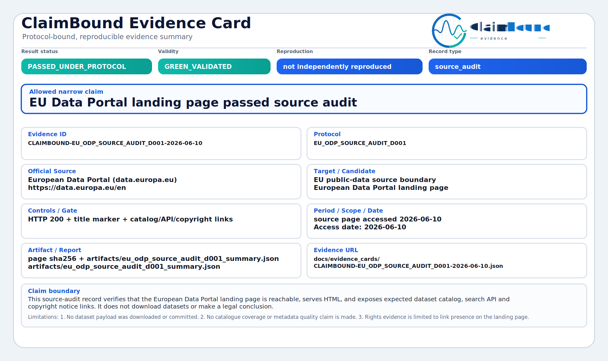
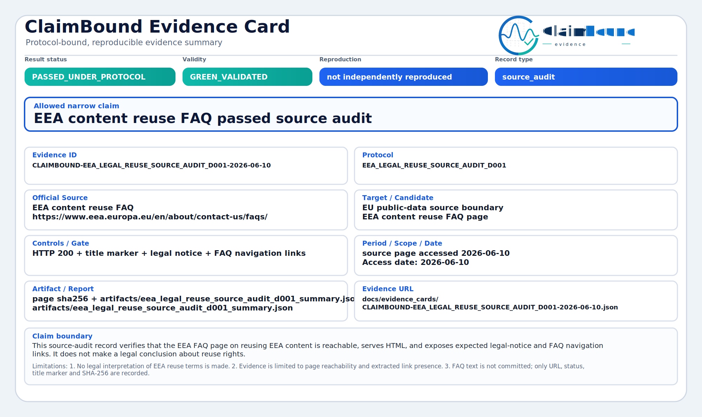
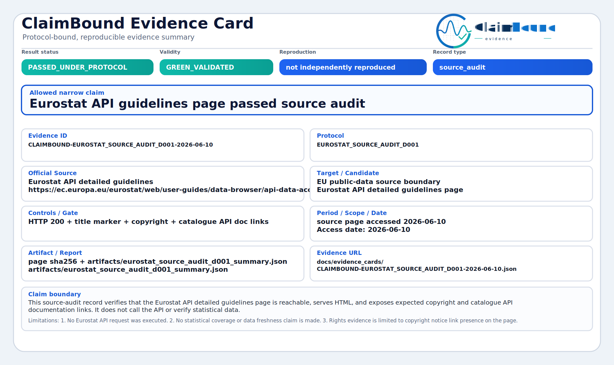

# European Dimension

ClaimBound supports European digital commons by making **public-source evidence**
for AI transparency and open-data claims inspectable under frozen protocols.

This page explains the European public-interest angle. It is not a legal opinion,
data-quality certification or program endorsement.

## Why this matters for European open internet

European public-data stewards, civic analysts and AI transparency reviewers need
records that show:

- which official source was used;
- which protocol was frozen before the outcome;
- whether the result passed, failed, was blocked or reproduced with drift;
- what the card must **not** be used to claim.

ClaimBound keeps those elements together in evidence cards instead of spreading
them across README claims, screenshots or informal success language.

## Current EU institutional examples

| Example | Status | What it proves |
| --- | --- | --- |
| [EEA source audit D001](evidence_cards/CLAIMBOUND-SOURCE_AUDIT_D001-2026-05-08.json) | `PASSED_UNDER_PROTOCOL` | The official EEA Air Quality download page passed a narrow source-boundary audit. |
| [EU Data Portal source audit D001](evidence_cards/CLAIMBOUND-EU_ODP_SOURCE_AUDIT_D001-2026-06-10.json) | `PASSED_UNDER_PROTOCOL` | The European Data Portal landing page exposed expected catalog, search API and copyright links. |
| [EEA content reuse FAQ source audit D001](evidence_cards/CLAIMBOUND-EEA_LEGAL_REUSE_SOURCE_AUDIT_D001-2026-06-10.json) | `PASSED_UNDER_PROTOCOL` | The EEA reuse FAQ page passed a narrow reachability and navigation-link audit only. |
| [Eurostat API guidelines source audit D001](evidence_cards/CLAIMBOUND-EUROSTAT_SOURCE_AUDIT_D001-2026-06-10.json) | `PASSED_UNDER_PROTOCOL` | The Eurostat API detailed guidelines page exposed expected copyright and catalogue API doc links. |
| [EEA AQ manual track D001](evidence_cards/CLAIMBOUND-EEA-AQ-D001-MANUAL-2026-05-11.json) | `BLOCKED_SOURCE` | A larger manual track was blocked by an incomplete public URL manifest — honest stop before overclaiming. |

These cards do **not** prove EU-wide data completeness, legal redistribution rights
for all datasets, or pollutant-model correctness.

### Green European source-audit cards (SVG previews)

<p align="center">
  
</p>

[CLAIMBOUND-EU_ODP_SOURCE_AUDIT_D001-2026-06-10](evidence_cards/CLAIMBOUND-EU_ODP_SOURCE_AUDIT_D001-2026-06-10.json) ·
[SVG](evidence_cards/CLAIMBOUND-EU_ODP_SOURCE_AUDIT_D001-2026-06-10.svg)

<p align="center">
  
</p>

[CLAIMBOUND-EEA_LEGAL_REUSE_SOURCE_AUDIT_D001-2026-06-10](evidence_cards/CLAIMBOUND-EEA_LEGAL_REUSE_SOURCE_AUDIT_D001-2026-06-10.json) ·
[SVG](evidence_cards/CLAIMBOUND-EEA_LEGAL_REUSE_SOURCE_AUDIT_D001-2026-06-10.svg)

<p align="center">
  
</p>

[CLAIMBOUND-EUROSTAT_SOURCE_AUDIT_D001-2026-06-10](evidence_cards/CLAIMBOUND-EUROSTAT_SOURCE_AUDIT_D001-2026-06-10.json) ·
[SVG](evidence_cards/CLAIMBOUND-EUROSTAT_SOURCE_AUDIT_D001-2026-06-10.svg)

## Blocked European track (intentional stop)

The [EEA AQ manual track D001](evidence_cards/CLAIMBOUND-EEA-AQ-D001-MANUAL-2026-05-11.json)
is an amber `BLOCKED_SOURCE` record. It shows that ClaimBound does not upgrade a
larger empirical PM10 coverage claim when the public URL-list path cannot support
a fair gate.

Allowed interpretation:

```text
The fixed BE/DE/NL PM10 manual track could not fairly run the coverage gate from
the public URL-list path because BE and NL URL manifests were missing while the
API summaries reported files.
```

Forbidden interpretation:

```text
This proves PM10 station coverage failed.
This proves the EEA source is unusable generally.
This proves air-quality forecasting performance or health impact.
```

## External operator path

External readers can verify the European source-audit runners locally without
private setup steps:

```bash
uv run python scripts/claimbound_run_eu_public_source_audit.py --profile EU_ODP_SOURCE_AUDIT_D001
uv run python scripts/claimbound_run_eu_public_source_audit.py --profile EEA_LEGAL_REUSE_SOURCE_AUDIT_D001
uv run python scripts/claimbound_run_eu_public_source_audit.py --profile EUROSTAT_SOURCE_AUDIT_D001
```

See also [EEA AQ manual track checklist](manual_audit/EEA_AQ_D001_MANUAL_TRACK.md),
[independent rerun examples](../examples/rerun/README.md) and
[External operator starter pack](EXTERNAL_OPERATOR_STARTER_PACK.md).

## Not on this page

US and global examples (NASA POWER, NOAA CO-OPS, Anthropic/OpenAI/Google/Grok
source audits) are documented in [Current evidence tracks](CURRENT_EVIDENCE_TRACKS.md).
They illustrate methodology parallels but are not EU institutional sources.

## Note: this is not an EU institutional endorsement section

These records are **operator-produced source-boundary evidence** under frozen
protocols. They do not imply endorsement, accreditation or legal clearance from
the European Commission, EEA, Eurostat or any EU member-state authority.

## European Dimension without overclaiming

Allowed public framing:

```text
ClaimBound helps inspect narrow European public-data and AI-documentation claims
under frozen protocols, with negative and blocked outcomes preserved.
```

Forbidden public framing:

```text
ClaimBound certifies EU data quality.
ClaimBound proves EEA or EU institutional endorsement.
ClaimBound replaces official data stewardship or legal review.
```

## Planned European work (public foreground)

The public roadmap includes additional European source-audit candidates under the
same narrow boundary rules:

- Copernicus CDS terms and registration boundary checks;
- ECDC open-data route audits;
- reproducible EU empirical gate examples with explicit drift notes.

Scaffolds may be published before completed cards. Scaffolds are gray and are not
evidence until validated.

## Read next

- [Current evidence tracks](CURRENT_EVIDENCE_TRACKS.md)
- [Public roadmap 2026](ROADMAP_2026.md)
- [Reviewer summary](REVIEWER_SUMMARY.md)
