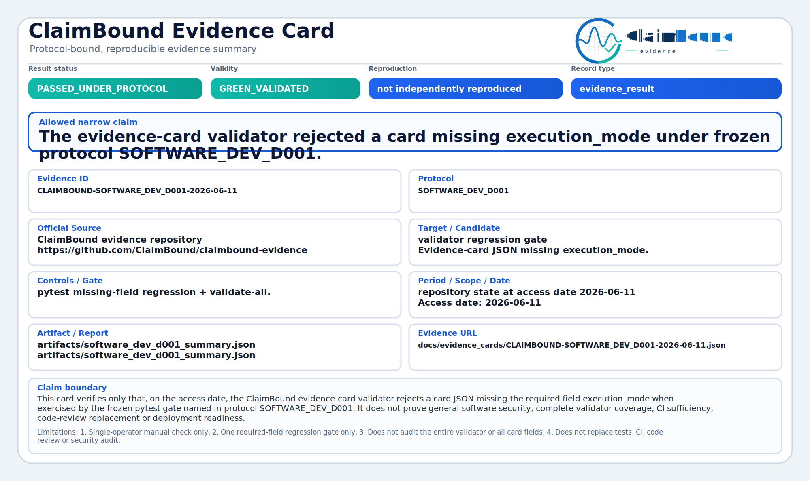

# Software R&D Evidence Case Study (External)

This page describes an **external methodology case study**: a multi-protocol
software R&D track that ended in **honest NO-GO closure** with preserved
negative and blocked evidence records.

It is not a ClaimBound evidence card. It is not proof that any closed-core
system works in production.

## Repository

Public sanitized export (methodology and negative/blocked records only):

```text
https://github.com/ClaimBound/software-rnd-evidence-case-study
```

Release: [v1.0.0](https://github.com/ClaimBound/software-rnd-evidence-case-study/releases/tag/v1.0.0).

The repository does not ship proprietary closed-core code, raw payloads or funding
application materials. Sanitization and audit gates run in a private source
repository before export.

## What the case study shows

| Element | Lesson for ClaimBound users |
| --- | --- |
| Frozen protocol ladder v0.3–v0.14 | Rules fixed before batch runs |
| 0 replication candidates | Negative results stay negative |
| Explicit track closure | Tombstone instead of silent continuation |
| Blocked domains (no labels) | `BLOCKED` is useful evidence |
| Evidence chain | protocol → dataset → run → report → record |

## Relation to ClaimBound

ClaimBound provides the **public evidence-card toolkit**. The case study shows
the same anti-overclaiming discipline applied to a private R&D program:

- green/foundation claims stay bounded;
- utility failure is documented, not hidden;
- funding or product narratives are not upgraded from weak deltas.

## Completed in-repo software example

Validated **software-development evidence card** inside this repository
(validator regression gate under frozen pytest commands):

<p>
  
</p>

[JSON](../evidence_cards/CLAIMBOUND-SOFTWARE_DEV_D001-2026-06-11.json) ·
[SVG](../evidence_cards/CLAIMBOUND-SOFTWARE_DEV_D001-2026-06-11.svg)

## Read next

- [Software development workflow](../SOFTWARE_DEVELOPMENT_WORKFLOW.md)
- [Evidence card examples](../evidence_cards/README.md)
- [12 AI Life Rules](../TWELVE_AI_LIFE_CONTROLS.md)
